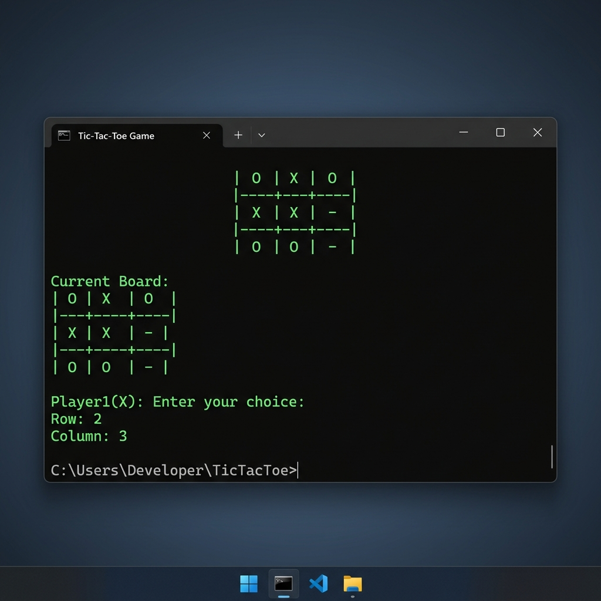

# Tic-Tac-Toe



A classic, console-based Tic-Tac-Toe game implemented in C++. This project demonstrates fundamental C++ programming concepts, including arrays, loops, and conditional logic.

## ✨ Features

- **Interactive Console Interface:** Simple and intuitive command-line interface.
- **Two-Player Gameplay:** Designed for two players to compete on the same machine.
- **Automatic Win Detection:** Checks for horizontal, vertical, and diagonal winning combinations.
- **Draw Handling:** Detects when the grid is full and declares a draw.

## 🛠️ Technologies Used

- **Language:** C++
- **Libraries:** `<iostream>`, `<conio.h>`, `<process.h>`

## 🚀 Getting Started

### Prerequisites

- A C++ compiler (e.g., MinGW, GCC).
- Windows environment (for `<conio.h>`).

### How to Run

1.  **Clone the repository:**
    ```bash
    git clone https://github.com/rajjitlai/TicTacToe.git
    cd TicTacToe
    ```
2.  **Compile the source code:**
    ```bash
    g++ TIC-TAC-TOE.cpp -o TicTacToe.exe
    ```
3.  **Run the game:**
    ```bash
    ./TicTacToe.exe
    ```

## 🎮 Instructions

1.  The game is played on a 3x3 grid.
2.  Player 1 is **X** and Player 2 is **0**.
3.  Players take turns entering the **Row** and **Column** (1-3) where they want to place their mark.
4.  The first player to get 3 of their marks in a row (horizontally, vertically, or diagonally) wins.
5.  If all 9 squares are filled and no player has 3 marks in a row, the game is a draw.

## 📜 License

Distributed under the MIT License. See [LICENSE](LICENSE) for more information.

---

**Copyright (c) 2022-2026 Rajjit Laishram**
